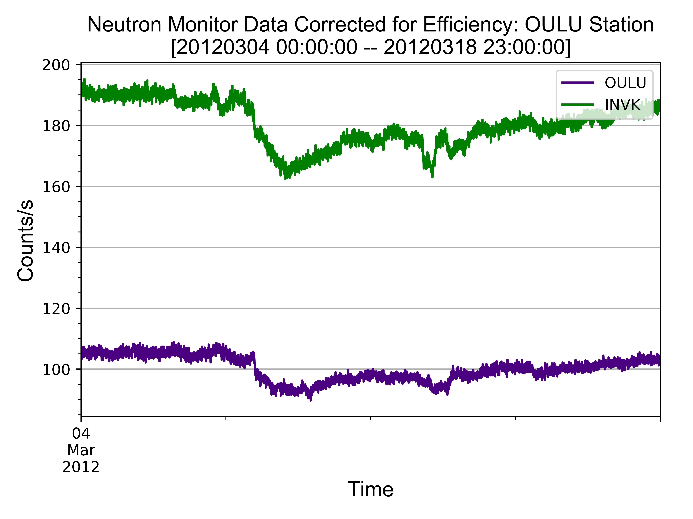
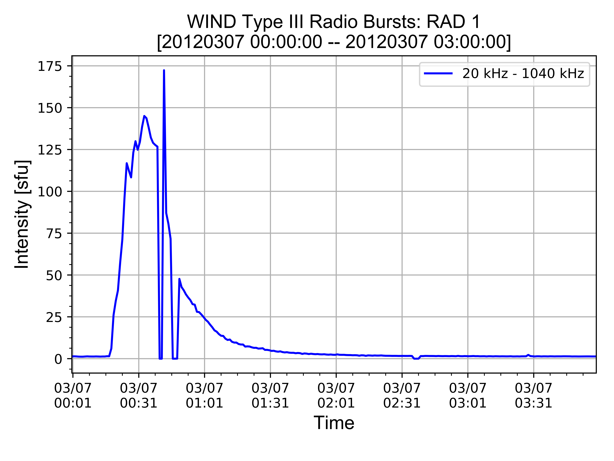

# Space Weather Projects

# Tasks
- [x] Proton Flux (7/3/2017)

- [x] Neutron Monitor (7/3/2017)

- [x] Type III Radio Bursts (7/3/2017)

- [x] Fix issues with matplotlib DateFormatter "year out of range" (7/5/2017)
	- [x] Added issue with null errors in data frames (7/5/2017)

- [ ] Remake Radio Burst script using CDF and online databases
    - [x] Use pycdf **(module: spacepy)** to read CDF data (7/6/2017)
    - [x] Push data into pandas dataframe (7/7/2017)
    - [ ] Set up automated url inputs

- [ ] Collect GOES-15 Xray data

- [ ] Collect WIND/ACE Solar Wind data

- [ ] Integrate all data into subplots

- [ ] Incorporate online databases for radio and proton data

# Current Errors and Pressing Tasks
### Set up online CDF reader through Python
- Add online functionality to ([radio_script_v2](https://github.com/byamashiro/Research_Projects/blob/master/radio_remastered.py)). The script currently runs offline with local data files. Attempt was made using urllib and requests, but response is in binary/byte format and cannot be read with .json() methods. Possibly encode/decode into ascii format and run through CDF methods. **Note**: Each .cdf file might contain different versions (i.e _v02) for string recognition.
- The easier and less efficient option would be to download the data from each site and run the .cdf reader locally.

### NaN values for Neutron Monitor script for lack of data
- Some neutron monitors do not have data and will return NaN values. When the script runs and the NaN values are added, the title columns will be shifted since there is no data in those columns. Essentially, 3 labels will be made for 2 columns, and the headers might not match the correlated data.


# Running Scripts

### Remastered WIND Type III Radio Burst ([radio_script_v2](https://github.com/byamashiro/Research_Projects/blob/master/radio_remastered.py))
- In progress

### Neutron Monitor ([nm_script](https://github.com/byamashiro/Research_Projects/blob/master/pandas_test_nm.py))
In [1]: **run pandas_test_nm.py**  
Enter start date (yyyymmdd): 20120304  
Enter a end date (yyyymmdd): 20120318  
Enter a start hour or "full": full  
How many stations to parse: 2  
You are parsing 2 station(s)  
Enter station names: INVK  
Enter station names: OULU  
Parsing the ['INVK', 'OULU'] stations  





### GOES-15 Proton Flux ([prot_script](https://github.com/byamashiro/Research_Projects/blob/master/pandas_test_proton.py))
In [2]: **run pandas_test_proton.py**  
Enter a start date (yyyymmdd): 20120305  
Enter a end date (yyyymmdd): 20120309  


### WIND Type III Radio Burst ([radio_script](https://github.com/byamashiro/Research_Projects/blob/master/pandas_test_radio.py))
In [3]: **run pandas_test_radio.py**  
Enter a start date (yyyymmdd): 20120307  
Enter a end date (yyyymmdd): 20120307  
Enter a start hour or "full": 00  
Enter a end hour: 03  
Parsing Type III Data: [20120307 00:00:00 -- 20120307 03:00:00]  
Elapsed Time: 16.3 seconds  





###### Sample displayed data of pandas data:

### Sample Type III Radio Burst Data
```
                             12            16        20        24        28  \
12_16                                                                         
2012-03-01 00:00:30  01-03-2012  00:00:30.000  1.182980  1.179540  1.176100   
2012-03-01 00:01:30  01-03-2012  00:01:30.000  1.281410  1.202890  1.124380   
2012-03-01 00:02:30  01-03-2012  00:02:30.000  1.021370  1.043250  1.065120   
2012-03-01 00:03:30  01-03-2012  00:03:30.000  1.107890  1.114680  1.121480 
...
```
### Neutron Monitor Data
```
                        OULU     INVK
datetime                             
2012-03-06 00:00:00  106.625  190.810
2012-03-06 00:05:00  105.342  189.426
2012-03-06 00:10:00  106.199  188.382
2012-03-06 00:15:00  105.591  191.880
2012-03-06 00:20:00  104.626  191.370
...
```

### Proton Flux Data
```
      P3W_QUAL_FLAG  P3W_UNCOR_CR  P3W_UNCOR_FLUX  P4W_QUAL_FLAG  \
0               NaN           NaN             NaN            NaN   
1               0.0      0.030488        0.093809            0.0   
2               NaN           NaN             NaN            NaN   
3               0.0      0.030488        0.093809            0.0   

...
```


Data Set | Normalized (Y/N) | Bad Data Specifiers
------------ | ------------- | -------------
Proton Flux | N | -99999.0, 0.0
Xray Flux | N | -99999.0, 0.0
Neutron Monitor Rate | N | n/a 
Radio Burst | N | n/a 


# Data
The data consists of mainly flux data from instruments on the ground, Earth orbit, and at the L1 Lagrange point. The data includes a sample from (2012 March), not normalized, and complete in intervals of about 30 seconds to a minute. Data values that were not accepted are denoted at extreme negative values around -9999. The specifics of each data set is commented in each header.

### Data Caveats
Corrupted data is labeled as -99999.0, and 0.0 flux is most probable to be corrupted as well. Corrupted data is changed using the pandas replace function to np.nan.

## Data originals
GOES-13 Proton Flux  
GOES-15 Xray Flux  
ACE Magnetic Field Components  
ACE Solar Wind Parameters  
OULU Neutron Monitor Data  


# Resolved Errors

### Null values (resolved 7/5/2017)
* **Resolution**: There were three spaces in front of the null values, delimit whitespace to removed them. As a quick fix, 3 spaces were added to the 'na_values' argument, '   null', ``` na_values=['   null']```.  

- Some values are being registered as 'null'. Tried to add ``` na_values=['null']``` to the read_csv function, but the null is still being processed and results in a plotting error. To recreate error, run the 'pandas_test_nm.py' script for 20120307-20120309 (full) for stations (2) INVK and OULU.
- Resolution will probably consist of removing null values, list comprehension on all null values in pandas dataframe.  
```TypeError: Empty 'DataFrame': no numeric data to plot```

```python
                       OULU     INVK
datetime                            
2012-03-08 17:28:00  96.459  176.470
2012-03-08 17:29:00  98.389  173.920
2012-03-08 17:30:00  94.656     null
2012-03-08 17:31:00  92.282  172.800
2012-03-08 17:32:00  94.688  175.980
2012-03-08 17:33:00  97.718  175.790
2012-03-08 17:34:00  97.269  177.460
2012-03-08 17:35:00  98.304  176.330
```

### DateFormatter (resolved 7/5/2017)
* **Resolution**: Used the matplotlib plot function instead of the pandas plot function. The new function used was ``` plt.plot(nm_data.index, nm_data[f'{i}'], color=rand_color, label=f'{i}')``` instead of ``` nm_data[f'{i}'].loc[f'{event_obj_start_str_date}':f'{event_obj_end_str_date}'].plot(color=rand_color, label= f'{i}')```.

- Code breaks when trying to format the x-axis labels using the DateFormatter function from matplotlib in the script, 'pandas_test_nm.py'.
- Potentially the index are of a different definition, although each index shows the correct format 'yyyy-mm-dd hh:mm:ss' in the specified time interval between 20120307-20120309. Also test if delimiter could be changed to 'delim_whitespace=True' in read_csv function.  
```ValueError: year 60740 is out of range```

```python
import matplotlib.dates as mdates

myFmt = mdates.DateFormatter('%m/%d\n%H:%M')
ax.xaxis.set_major_formatter(myFmt) #this is line that breaks code (ValueError: year 60740 is out of range)
```

