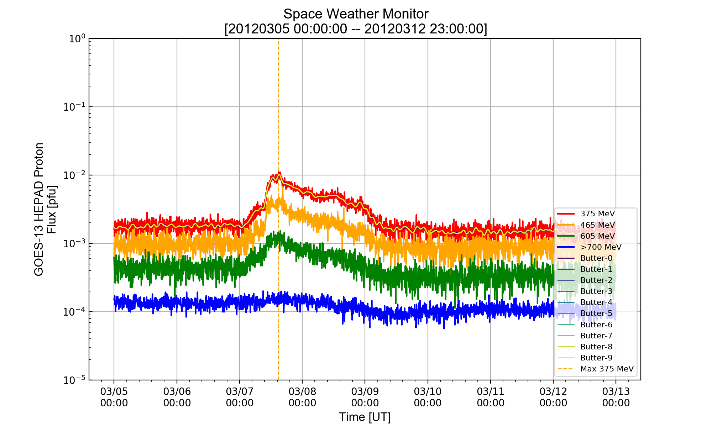

# Space Weather Projects

**Table of Contents**

- [Current Tasks and Errors](#current-tasks-and-errors)
- [Required Python Modules](#required-python-modules)
- [Running Scripts](#running-scripts)
  - [OMNI Space Weather Monitor (omni_script_v4)](#omni-space-weather-monitor-omni_script_v4)
  - [Proton Event Flare Location Projection (projection_script_v1)](#proton-event-flare-location-projection-projection_script_v1)
  - [GOES Proton Event Detector (goes_detector_script_v1)](#goes-proton-event-detector-goes_detector_script_v1)
  - [Remastered WIND Type III Radio Burst (radio_script_v3)](#remastered-wind-type-iii-radio-burst-radio_script_v3)
  - [Radio Burst Fit Program (radio_fit_v1)](#radio-burst-fit-program-radio_fit_v1)
  - [Bartels' Rotation Number (bartels_v1)](#bartels-rotation-number-bartels_v1)
  - [Legacy OMNI Space Weather (1995-2009) (legacy_omni_script_v1)](#legacy-omni-space-weather-1995-2009-legacy_omni_script_v1)
- [Deprecated Scripts](#deprecated-scripts)
- [Data](#data)
- [Completed Tasks](#completed-tasks)
- [Resolved Errors](#resolved-errors)
- [Delayed Tasks](#delayed-tasks)


# Current Tasks and Errors
<details><summary>Task List</summary>
<p>

- [ ] Set a variable up in the preface of the code to specify options
  - [x] If files should be saved (9/6/2017)
  - [ ] The min/max parameter to draw vertical lines on each subplot
  - [x] Add an option to use a list for events in OMNI (9/8/2017)

- [ ] Add documentation for system and specifics on set parameters.
  - [ ] Add python version 3.0+
  - [ ] Set parameters
    - [ ] Paths
    - [ ] Save settings

- [ ] Collect WIND/ACE Solar Wind data
  - [x] Bulk speed (7/12/2017)
  - [ ] Temperature
  - [ ] Magnetic field components/absolute value

- [ ] GOES Event Detector
  - [x] Download data files from web for each year (09/10/2017)
    - [x] Incorporate both GOES-13 and GOES-15 (09/10/2017)
  - [x] Set threshold level for each event in the >100 MeV energy range (09/10/2017)
  - [x] Create sets to show the differences and intersections of both satellites (09/10/2017)
  - [x] For loops to plot data for each day to confirm proton event (9/11/2017)
    - [x] Indicate overlaps in events that aren't separated by over a day (9/11/2017)
    - [ ] Create export files to be able to run with the OMNI event script
  - [ ] Devise method to mark two thresholds to show the difference between threshold levels
  - [ ] If statement to not have to determine events every time
    - [ ] Export file to save generated event lists for time saving
      - [ ] Option to use an exported list for event plotting
  - [x] Make the y axis for pfu a constant from 0.01 to 100 to show an equal scaling (09/15/2017)
  - [ ] Add a counter to show how many events happened for GOES-13, GOES-15, both 
    - [ ] Run same algorithm as year_full on the unique events to get a count for all total events including lists (i.e [1,2,3])
  - [x] Add a purge option to remove data files that have incomplete data due to real time retrieval (09/25/2017)
  - [ ] Create an algorithm that will differentiate between two events that are merged in one (i.e 20140106)
  - [ ] Add the lower energy channels <100 MeV
    - [ ] Set a new threshold value for proton events
    - [ ] Add statement to toggle between energy channels
  - [ ] If a certain threshold is hit by the respective energy range, highlight in yellow

- [ ] Type III Radio Burst Fitting Program
  - [ ] Fit multiple models to 20120307 event
    - [x] Skewed Gaussian (09/15/2017)
    - [x] Exponential Gaussian (09/15/2017)
    - [x] Donaich (09/15/2017)
    - [ ] Log-normal
  - [ ] Make multiple subplots, separating each fit model
  - [ ] Create new fitting algorithm that accounts for double peaks (i.e multiple events stack on each other)
  - [ ] Average the background for multiple days before the event to determine a steady background fit

- [ ] Data analysis of Type III radio bursts (fluence and correction)
  - [ ] Incorporate a program/function to calculate agreement with Parker Spiral equations
  - [ ] Agreement plots
    - [ ] Peak proton flux
    - [ ] AR Magnetic flux/area


- [ ] OMNI Script Radio Bursts
  - [ ] Add RAD2 data to the Wind Radio Bursts
  - [ ] Update algorithm for sigma clipping
  - [ ] Test the higher level frequencies for intensity anomalies

- [ ] Fluence Correlation Plots
  - [ ] Remake correlation with new intensities from RAD2 integration


</p>
</details>

<details><summary>Current Tasks and Errors</summary>
<p>

### HEPAD algorithm does not incorporate different months
- If the months of the start and end date are not identical, the HEPAD data only plots the month corresponding to the "start_date". To recreate the issue, run either the OMNI script or the HEPAD event script with the start date 20130928 to 20131001. The opposite case is also affected when subtracting a day that leaks into the prior month (20140831 to 20140903). The latter case occurs during the HEPAD event script as the start and end date are determined by -1 and +2 of the entered event date, respectively.


### OMNI script highlighting does not work for day intervals
- To recreate this issue, run OMNI script for 20120307 and the event will not be highlighted. The highlight is present when the full event is parsed, therefore running the script from 20120306 to 20120315 will produce the correct results.


### OMNI script outlier algorithm fails for longer time ranges
- When compiling a range of dates (20120306 to 20120315), the algorithm fails to remove the outlier data point on 20120307. The algorithm works for shorter time ranges (i.e 1-3 days), therefore the subsequent radio burst events raise raise the variance threshold.


### OMNI script crash with multiple dates and downloads
- When retrieving data for plots, that do not exist locally, a key error is produced while plotting. This value error does not trigger when local files exist. 
```python
...
========================================
=         STEREO-B Proton Flux         =
========================================
100% [....................................................] 13073516 / 13073516---------------------------------------------------------------------------
ValueError                                Traceback (most recent call last)
/Users/bryanyamashiro/miniconda3/envs/classUHenv/lib/python3.6/site-packages/pandas/core/indexes/base.py in get_slice_bound(self, label, side, kind)
   3434             try:
-> 3435                 return self._searchsorted_monotonic(label, side)
   3436             except ValueError:

/Users/bryanyamashiro/miniconda3/envs/classUHenv/lib/python3.6/site-packages/pandas/core/indexes/base.py in _searchsorted_monotonic(self, label, side)
   3393 
-> 3394         raise ValueError('index must be monotonic increasing or decreasing')
   3395 

ValueError: index must be monotonic increasing or decreasing

During handling of the above exception, another exception occurred:

KeyError                                  Traceback (most recent call last)
/Users/bryanyamashiro/Documents/Research_Projects/Scripts/pandas_test_omni.py in <module>()
   1304 
   1305         next_global()
-> 1306         axes[length_data_list[j]].plot(sta_df[27].loc[f'{event_obj_start_str_date}':f'{event_obj_end_str_date}'], color='darkred', label='35.5-40.5 MeV', zorder=5)
   1307         axes[length_data_list[j]].plot(sta_df[29].loc[f'{event_obj_start_str_date}':f'{event_obj_end_str_date}'], color='red', label='40.0-60.0 MeV', zorder=5)
   1308         axes[length_data_list[j]].plot(sta_df[31].loc[f'{event_obj_start_str_date}':f'{event_obj_end_str_date}'], color='orange', label='60.0-100.0 MeV', zorder=5)
...

KeyError: '20130929 00'
```

### Neutron monitor data retrieval failsafe for OMNI script
- Current neutron monitor dataset relies on internet connection, therefore local files are not saved. This is because different slices of neutron monitor data, using the start and end hours, will result in data that is not uniform unless using the 'full' day. 1) Save neutron monitor data only when full day is obtained, but data outages will lead to script errors when taking slices of local files. 2) Create a check to determine if data can be downloaded (i.e connection == True, no HTTPError), if not, remove from 'option_bin_set' and let the figure loading reflect the change in 'option_bin_set' length.


### Log-normal distribution fit for radio bursts
- Even with the "missing='drop'" parameter, the fit still detects NaN values. Although nan elements exist, the other fits allowed for removal of nans with the 'missing' method. There is a possible discrepancy in the parameters, as the Log-normal distribution does not include the gamma factor, which is present in the other three fits that work.
```python
ValueError                                Traceback (most recent call last)
/Users/bryanyamashiro/Documents/Research_Projects/Scripts/pandas_test_radio_fit.py in <module>()
    354                 params_lognorm = model_lognorm.make_params(amplitude=ymax_val, center=ymax_center, sigma=1)
    355 
--> 356                 log_normal = model_lognorm.fit(yvals, params_lognorm, x = xvals)
    357                 print("Log Normal Model\n", log_normal.fit_report())
    358 
...
ValueError: The input contains nan values
```

### Fitting techniques and dropped values
- Values of 0.0 are dropped due to the absence of physical intuition for these phenomena. This in turn allows for a continuous line while plotting from the last known value to the value after the dropped 0.0 value. This causes a problem when creating fits because a evenly spaced sequence is used, namely 'np.arange'. When the final fits are plotted, the dropped index values cause the fit to be discontinuous, illustrated by jagged edges.

### Comparison check with event lists
- Compare the files from the event list against the xflare list. Check the intensities of radio bursts and xflares, and put an indicator for xflares that coincide with the radio bursts (i.e mark with 'red').

### Version check and checking if the file exists
- When checking if a file exists, there is a slight issue when running into the loops. Currently the code will search if the file exists first, and then assigns a boolean, then runs the loop to look for versions. The loops that cycle through various versions will create a False value every time. Possibly implement a scheme that'll search for the existing file after pulling the file from online.
```radio_check = os.path.isfile(f'{data_directory}/WIND/RAD1/{radio_name}')```

### Type III radio burst representation
- Change the radio burst average into a spectrogram. Try the 'plt.pcolormesh(t, f, Sxx)' function into the radio burst subplot. The 't' for time, 'f' for frequency. 


### Type III radio burst event list
- Check events over 100 MeV threshold for GOES proton flux.
  - Automate process and add an if statement for 1) if intensities are over ~100 sfu, and 2) specified durations of frequencies.
- Match each Type III event with proton flux, xray flux, etc.

### Download local files
- Instead of downloading data every instance of the code (i.e OMNI), store a repository of data on the local drive.
  - If the local file does not exist, download from the web. Vice versa, if the local file exists, parse the file rather than downloading. Create the path in the script header to allow for quick changes to the local download folder.

### Create data template for specific events
- Previous versions of the code parsed two days before the event and five following the event. Make an external file that can be read in with a few parameters.
  - Event date, which data sets

### Incorporate sunpy package
- The sunpy package may contain data sources for level 2 data. This may be faster than downloading and importing data for each datetime instance for longer time intervals

### Collect science
- Maximum: Proton flux, xray flux, solar wind speed, radio burst intensity/duration.
- Minimum: Neutron monitor counts, dst (not currently implemented).
- Write datetime, index, max, and min to a datafile.


### Download SOHO proton flux data and plot
1) SOHO data title format is not uniform (i.e erne-yyyy.mm.dd-yyyy.mm.dd-{non-uniform-number}.tgz)
2) SOHO data is in .tgz format, with the tar files including 20+ data files in them. Only files of HED#.SL2 are of use.
- Current options
  - **wget**: Download .tgz file, extract only HED*.SL2 and push data into memory, delete local files, plot (downloading to local)
  - **urllib, tarfile**: Read .tgz into memory, extract only HED*.SL2 and push data into memory, plot (time intensive, no backwards seeking)
3) Download only the HED without the wget function extracting the low energy files.

### Seeking backwards with tarfile
- The current method is inefficient as all the files in the tarfile must be first read into memory, then applying statements. The script currently is time intensive, possibly due to the tarfile existing online. A possibility for the time inflation could be that the script iterates through every element of the tarfile to load headers, then must repeat the process to press 'if' statements.
- Using an 'if' statement with the tarfile.open() command results in an error. This error seems to be caused because the 'if' statement reads through the entire tarfile with the cursor at the end. The action following the 'if' statement then tries to proceed, but since the cursor is at the end, the script fails when moving in the opposite direction. Potential solution is to find a .seek(0) function for the tarfile module.  
```StreamError: seeking backwards is not allowed```  

```python
with tarfile.open(fileobj=ftpstream, mode="r|gz") as tar:
    hed_soho = [
      tarinfo for tarinfo in tar.getmembers()
      if tarinfo.name.startswith('export.src/HED') # the error occurs at this point
  ]
  tar.extractall(members=hed_soho)
```

### Outliers and changes for Solar Wind script
- Values significantly over 1000 km/s and single points need to be removed from the dataset. Incorporate temperature and magnetic field components from both ACE and Wind. Aesthetic fixes to the current wget downloading scheme, and find a more efficient method of downloading variant versions of .cdf files. Look for different data sources for solar wind speed with a lower time interval. Deviations are not negligible between both ACE and Wind solar wind speed measurements, see the output [figure](Plots/solarwind_test.png).


### Outliers for Radio Burst script
- Values ~300 sfu that seem to be outliers. Values will be removed, but each spike includes more than 1 point, therefore a single max threshold will not suffice.


### NaN values for Neutron Monitor script for lack of data
- Some neutron monitors do not have data and will return NaN values. When the script runs and the NaN values are added, the title columns will be shifted since there is no data in those columns. Essentially, 3 labels will be made for 2 columns, and the headers might not match the correlated data.

</p>
</details>


# Required Python Modules
<details><summary>Current Python: Version 3.6.1</summary>
<p>

Module       | Submodule(s) | as | Uses
------------ | ------------- | ------------- | -------------
**pandas**       | -                | pd              | DataFrames, indexing, plotting, downloading http url data, csv_reader()
**numpy**        | -                | np              | NaN values
**spacepy**      | pycdf            | -               | Reading Common Data Format
**urllib**       | error            | -               | For HTTPError recognition
**random**       | -                | -               | Randomizer for random colors
**matplotlib**   | .pyplot, .mdates | plt, mdates, cm | Plotting, subplots, date formatting, color map (viridis)
**datetime**     | -                | -               | Datetime indexing, datetime strings, datetime conversion from strings
**sys**          | -                | -               | Exiting script
**wget**         | -                | -               | Downloading files online (.cdf, .csv, .ascii, .txt)
**os**           | -                | -               | Remove files through script
**calendar**     | -                | -               | Retrieves final date of the month specified
**shutil**       | -                | -               | Moves files into specified directories

</p>
</details>


## Installing Dependencies
<details><summary>pip install</summary>
<p>

- matplotlib
- numpy
- pandas
- datetime
- <details><summary>spacepy (dependencies collapsed)</summary>
  <p>

  - numpy
  - matplotlib
  - ffnet
    - gcc
    - gfortran
  - scipy
  - networkx

  </p>
  </details>

</p>
</details>


# Data Sources

<details><summary>Currently Implemented</summary>
<p>

Data       | Instrument | Detector | Source | URL
------------ | ------------- | ------------- | -------------| -------------
**GOES Proton Flux**            | GOES-13,15        | EPEAD               | NOAA   | https://satdat.ngdc.noaa.gov/sem/goes/data/new_full/
**Legacy GOES Proton Flux**     | GOES-08,10        | EPS                 | NOAA   | https://satdat.ngdc.noaa.gov/sem/goes/data/new_avg/
**TypeIII Radio Burst**         | Wind              | RAD1 (20-1040 kHz)  | CDAW   | https://cdaweb.gsfc.nasa.gov/pub/data/wind/waves/wav_h1/
**GOES Xray Flux**              | GOES-15           | XRS                 | NOAA   | https://satdat.ngdc.noaa.gov/sem/goes/data/new_full/
**Neutron Monitor Counts**      | NM Stations       | IGY, NM64           | NMDB   | http://www.nmdb.eu/nest/
**ACE Solar Wind Parameters**   | ACE               | SWEPAM              | CDAW   | https://cdaweb.gsfc.nasa.gov/pub/data/ace/swepam/level_2_cdaweb/swe_h0/
**Wind Solar Wind Parameters**  | Wind              | SWE                 | CDAW   | https://cdaweb.gsfc.nasa.gov/pub/data/wind/swe/swe_k0/
**STEREO-A/B Proton Flux**      | STEREO            | HET                 | IMPACT | http://stereo.ssl.berkeley.edu/

</p>
</details>

<details><summary>Prospective Data Sets</summary>
<p>

**Kp Index**     | Ground Based Magnetometers                | Planetary           | NOAA | ftp://ftp.swpc.noaa.gov/pub/indices/old_indices/
**Dst Index**          | Ground Based Magnetometers                | Kyoto           | WDC | http://wdc.kugi.kyoto-u.ac.jp/
**AE Index**         | -                | -           | - | -
**SOHO Proton Flux**           | SOHO                | ERNE           | SRL | https://srl.utu.fi/export/
****           | -                | -           | - | -
****           | -                | -           | - | -
****           | -                | -           | - | -

</p>
</details>

# Running Scripts

### OMNI Space Weather Monitor ([omni_script_v4](https://github.com/byamashiro/Research_Projects/blob/master/Scripts/pandas_test_omni.py))

<details><summary>OMNI Command Line Example</summary>
<p>

```shell
In [5]: run pandas_test_omni.py
========================================
=               DATASETS               =
========================================
1 - GOES-13/15 Proton Flux
2 - Wind Type III Radio Bursts
3 - Neutron Monitor Counts (Requires Internet Connection)
4 - ACE/Wind Solar Wind Speed
5 - GOES-13/15 Xray Flux
6 - STEREO-A Proton Flux
7 - STEREO-B Proton Flux
========================================
Enter Dataset Option then "done" or "all": all
Enter a start date (yyyymmdd): 20120307
Enter a end date (yyyymmdd): 20120307
Enter a start hour or "full": full
Specify which GOES Satellite for Proton Flux (13 or 15): 13

  
========================================
=         GOES-13 Proton Flux          =
========================================

========================================
=      Wind Type III Radio Bursts      =
========================================


Number of Radio Events (2012-03-07 - 2012-03-07):  2
           start_time            end_time  t3_duration  t3_max_int  \
0 2012-03-07 00:21:30 2012-03-07 02:18:30        117.0   52.680389   
1 2012-03-07 07:35:30 2012-03-07 07:50:30         15.0    9.096712   

  default_color  
0         green  
1         green  

========================================
=           Neutron Monitors           =
========================================
How many stations to parse: 1
You are parsing 1 station(s)
Enter station names: OULU
Parsing the ['OULU'] stations

========================================
=      ACE/Wind Solar Wind Speed       =
========================================

Specify which GOES Satellite for Xray Flux (13 or 15): 15

========================================
=          GOES-15 Xray Flux           =
========================================

========================================
=         STEREO-A Proton Flux         =
========================================

========================================
=         STEREO-B Proton Flux         =
========================================
GOES-13 Peak Proton Flux (>10 MeV): (2012-03-07 16:20:00) 1.637E+03 [pfu]
GOES-13 Peak Proton Flux (>50 MeV): (2012-03-07 15:35:00) 2.537E+02 [pfu]
GOES-13 Peak Proton Flux (>100 MeV): (2012-03-07 15:20:00) 5.681E+01 [pfu]
```

</p>
</details>


#### GOES-13 HEPAD Implementation and Applied Butterworth Filters



### Proton Event Flare Location Projection ([projection_script_v1](https://github.com/byamashiro/Research_Projects/blob/master/Scripts/pandas_location_flareclass.py))

<details><summary>Proton Event Flare Location Projection Command Line Example</summary>
<p>

```shell
In [11]: run pandas_location_flareclass.py
```

</p>
</details>


### GOES Proton Event Detector ([goes_detector_script_v1](https://github.com/byamashiro/Research_Projects/blob/master/Scripts/goes_proton_event_detector.py))

<details><summary>GOES Proton Event Detector Command Line Example</summary>
<p>

```shell
In [17]: run goes_proton_event_detector.py
Enter the energy channel (10/50/100): 100
Enter year to parse (yyyy) or 'all': all

========================================
=   GOES-13/15 Proton Event Detector   =
========================================
========================================
=                 2011                 =
========================================
GOES-13 Proton Events
-------------------------
GOES-15 Proton Events
-------------------------
Parsing month - 12
============================================================
GOES-13 Events (2011): ['20110321', '20110607', '20110608', '20110804', '20110809', '20110907']
--GOES-13 Unique Events (2011): ['20110321']

GOES-15 Events (2011): ['20110607', '20110608', '20110804', '20110809', '20110907']
--GOES-15 Unique Events (2011): []
============================================================

Shared Events (2011): ['20110607', '20110608', '20110804', '20110809', '20110907']
...
```

</p>
</details>


### Remastered Wind Type III Radio Burst ([radio_script_v3](https://github.com/byamashiro/Research_Projects/blob/master/Scripts/radio_event_remastered.py))

<details><summary>Remastered Wind Type III Radio Burst Command Line Example</summary>
<p>

```shell
In [51]: run radio_event_remastered.py  
  
Plotting Type III Data: [20120307 00:00:00 -- 20120307 02:00:00]  
Plot generated for 20120307  
```

</p>  
</details>


### Radio Burst Fit Program ([radio_fit_v1](https://github.com/byamashiro/Research_Projects/blob/master/Scripts/pandas_test_radio_fit.py))

<details><summary>Radio Burst Fit Program Command Line Example</summary>
<p>

```shell
In [49]: run pandas_test_radio_fit.py  
========================================  
=       Radio Burst Fit Program        =  
========================================  
Enter a start date (yyyymmdd): 20120307  
Enter a end date (yyyymmdd): 20120307   
Enter a start hour or "full": 00  
Enter a end hour: 01  
```

</p>
</details>


### Bartels' Rotation Number ([bartels_v1](https://github.com/byamashiro/Research_Projects/blob/master/Scripts/bartels.py))

<details><summary>Bartels' Rotation Number Command Line Example</summary>
<p>

```shell
In [148]: run bartels.py  
  
========================================  
=       Bartels Rotation Number        =  
========================================  
Input Start Date (yyyymmdd): 20120303  
Input End Date (yyyymmdd): 20120313  
Bartels Rotation (2012-03-03):  2436  
Bartels Rotation (2012-03-13):  2437  
```

</p>
</details>

### Legacy OMNI Space Weather (1995-2009) ([legacy_omni_script_v1](https://github.com/byamashiro/Research_Projects/blob/master/Scripts/pandas_test_legacy.py))

<details><summary>Legacy OMNI Space Weather (1995-2009) Command Line Example</summary>
<p>

In [583]: run pandas_test_legacy.py  
========================================  
=               DATASETS               =  
========================================  
1 - GOES-8,10 Proton Flux (1995-Present)  
2 - Wind Type III Radio Bursts (1994-Present)  
3 - Neutron Monitor Counts  
4 - ACE/Wind Solar Wind Speed (1998-Present)/(1994-Present)  
5 - GOES-8,10 Xray Flux (1995-Present)  
========================================  
Enter Dataset Option then "done" or "all": 1  
Enter Dataset Option then "done" or "all": 2  
Enter Dataset Option then "done" or "all": 4  
Enter Dataset Option then "done" or "all": 5  
Enter Dataset Option then "done" or "all": done  
Enter a start date (yyyymmdd): 20031028  
Enter a end date (yyyymmdd): 20031028  
Enter a start hour or "full": full  
========================================  
=           GOES Satellites            =  
========================================  
1 - GOES-8 (1995 - 1998)  
2 - GOES-10 (1999 - 2009)  
3 - GOES-13 (2010 - Present) DO NOT USE!  
========================================  
Enter GOES Satellite Option: 2  
  
========================================  
=  GOES-10 Time Averaged Proton Flux   =  
========================================  
Energy Channels  
--------------------  
1: 0.6 - 4.0 MeV  
2: 4.0 - 9.0 MeV  
3: 9.0 - 15.0 MeV  
4: 15.0 - 44.0 MeV  
5: 40.0 - 80.0 MeV  
6: 80.0 - 165.0 MeV  
7: 165.0 - 500.0 MeV  
Enter Energy Channel(s) or "full": full  
100% [..........................................................................] 5637540 / 5637540  
========================================  
=      Wind Type III Radio Bursts      =  
========================================  
100% [..........................................................................] 3539967 / 3539967  
Parsing Type III Data for 2003-10-28  
  
========================================  
=      ACE/Wind Solar Wind Speed       =  
========================================  
100% [............................................................................] 165376 / 165376  
========================================  
=   GOES-10 Time Averaged Xray Flux    =  
========================================  
========================================  
=           GOES Satellites            =  
========================================  
1 - GOES-8 (1995 - 1998)  
2 - GOES-10 (1999 - 2009)  
3 - GOES-13 (2010 - Present) DO NOT USE!  
========================================  
Enter GOES Satellite Option: 2  
100% [..........................................................................] 2097840 / 2097840  

</p>
</details>


# Deprecated Scripts
Deprecated [scripts](https://github.com/byamashiro/Research_Projects/tree/master/Scripts/deprecated_scripts) are kept for reference. All scripts are working, but most do not incorporate online data fetching. The first [event script](https://github.com/byamashiro/Research_Projects/blob/master/Scripts/deprecated_scripts/deprecated_event.py) that used local files is included in the folder. The event script is highly inefficient as it reads data from year-long data files. This is not the desired method when pulling data from half a day, which in turn will read the entire year data. Old [bash scripts](https://github.com/byamashiro/Research_Projects/tree/master/Scripts/deprecated_scripts/bash_scripts) are also added to archive old/inefficient methods of collecting data and reducing. Most script descriptions were added to the deprecated folder. The omni script has the functionality of all of the deprecated scripts, and will be updated.


<details><summary>Example Deprecated Scripts</summary>
<p>

Filename       | Type | Run Command | Functionality
------------ | ------------- | ------------- | -------------
[getgoes.sh](https://github.com/byamashiro/Research_Projects/blob/master/Scripts/deprecated_scripts/bash_scripts/getgoes.sh)  | bash                | ./get_goes.sh yyyymm yyyy mm  | Download datafile from GOES-13/15 (first EPEAD then HEPAD), make directory for intermediate files and final converted files, delete all header rows, collect only specified columns, delimit from ',' to ' ', move cleaned data to directory, delete intermediate files.

</p>
</details>

# Data
The data consists of mainly flux data from instruments on the ground, Earth orbit, and at the L1 Lagrange point. The data includes a sample from (2012 March), not normalized, and complete in intervals of about 30 seconds to a minute. Data values that were not accepted are denoted at extreme negative values around -9999. The specifics of each data set is commented in each header.


<details><summary>Data Caveats</summary>
<p>

Data labeled as -99999.0 and 0.0 are converted to 'np.nan' values for all current working scripts.

Data Set | Normalized (Y/N) | Bad Data Specifiers
------------ | ------------- | -------------
Proton Flux | N | -99999.0, 0.0
Xray Flux | N | -99999.0, 0.0
Neutron Monitor Rate | N | n/a 
Radio Burst | N | n/a
Solar Wind Speed | N | < 0.0

</p>
</details>

<details><summary>Data Originals</summary>
<p>

GOES-13 Proton Flux  
GOES-15 Xray Flux  
ACE Magnetic Field Components  
ACE Solar Wind Parameters  
OULU Neutron Monitor Data  

</p>
</details>

<details><summary>Sample Data Format</summary>
<p>

#### Sample Type III Radio Burst Data
```
                             12            16        20        24        28  \
12_16                                                                         
2012-03-01 00:00:30  01-03-2012  00:00:30.000  1.182980  1.179540  1.176100   
2012-03-01 00:01:30  01-03-2012  00:01:30.000  1.281410  1.202890  1.124380   
2012-03-01 00:02:30  01-03-2012  00:02:30.000  1.021370  1.043250  1.065120   
2012-03-01 00:03:30  01-03-2012  00:03:30.000  1.107890  1.114680  1.121480 
...
```
#### Neutron Monitor Data
```
                        OULU     INVK
datetime                             
2012-03-06 00:00:00  106.625  190.810
2012-03-06 00:05:00  105.342  189.426
2012-03-06 00:10:00  106.199  188.382
2012-03-06 00:15:00  105.591  191.880
2012-03-06 00:20:00  104.626  191.370
...
```

#### Proton Flux Data
```
      P3W_QUAL_FLAG  P3W_UNCOR_CR  P3W_UNCOR_FLUX  P4W_QUAL_FLAG  \
0               NaN           NaN             NaN            NaN   
1               0.0      0.030488        0.093809            0.0   
2               NaN           NaN             NaN            NaN   
3               0.0      0.030488        0.093809            0.0   

...
```

</p>
</details>


# Completed Tasks

<details><summary>Completed Task List</summary>
<p>

- [x] Remastered Wind Type III Radio Burst Update (03/19/2018)
  - [x] Add the sigma clipping algorithm from the omni script (03/19/2018)

- [x] OMNI script proton event clipping (03/19/2018)
  - [x] Slice the month into the event days entered (03/19/2018)
  - [x] Modify the algorithms to operate on the sliced data (03/19/2018)
  - [x] Fix the highlighting algorithm to work for single days (03/19/2018)

- [x] OMNI Type III Radio Bursts (12/30/2017)
  - [x] Implement the radio detection for a given frequency and duration limit (12/30/2017)
   - [x] Integrate radio burst detection algorithm into OMNI script (11/22/2017)
    - [x] Horizontal line for t3 threshold and vertical lines for start and end time of event (11/22/2017)
    - [x] Plot lines/shaded area for corresponding radio burst (12/30/2017)
    - [x] Set an intensity threshold as a static parameter in the preamble (11/22/2017)
    - [x] Threshold must be low for backside events (i.e 20120723) (12/30/2017)
    - [x] Include every detected radio burst in the given range (12/30/2017)

- [x] GOES-13 xray flux (12/30/2017)
  - [x] Add markers and tags to certain xray flux magnitudes (12/30/2017)
  - [x] Add GOES-13 xray flux (9/6/2017)

- [x] Create an projection of the Sun using cartopy/basemap/aitoff (12/30/2017)
  - [x] Sun projection from -180 to 180, including the back side (12/30/2017)
  - [x] Plot individual events on the Sun (12/30/2017)

- [x] Corrected GOES proton flux (10/23/2017)
  - [x] Change all proton flux from new_full to new_avg data (10/18/2017)
  - [x] Add an 'if' statement to deal with an overlap of monthly data (i.e Jan. - Feb.) (10/23/2017)

- [x] Bartels' Rotation Converter (09/27/2017)
  - [x] Function to convert date to Bartels' rotation number (09/27/2017)

- [x] Local file code conversion (09/10/2017)
  - [x] GOES-13/15 Proton flux (8/30/2017)
  - [x] WIND Type III Radio Burst (8/30/2017)
  - [x] ACE Solar Wind speed (09/10/2017)
  - [ ] ~~Neutron Monitor counts/s~~ (NM data is downloaded specifically for each event, therefore data is too unique to save)
  - [x] GOES-13/15 Xray flux (09/10/2017)

- [x] Create a folder for local data. (.../Research_Projects/**Data**) (8/26/2017)
  - [x] Separate into mission names (i.e GOES, WIND, ACE, etc.) (8/26/2017)
  - [x] Remove 'sample_data' folder from Scripts directory. (8/22/2017)


- [x] Revamp the radio burst script (8/08/2017)
  - [x] Plot all frequencies on separate plots (8/08/2017)
  - [x] Find the most optimal subplot (8/08/2017)


- [x] Add feature to add a line for extrema (i.e max, min, etc.) (7/22/2017)


- [x] Switch all GOES proton flux from GOES-15 to GOES-13 (7/19/2017)


- [x] Collect GOES-15 Xray data (7/18/2017)
- [x] Incorporate online databases for radio and proton data (7/18/2017)

- [x] Remake GOES Proton Flux scripts (7/18/2017)
  - [x] Automate script to download File name: g15_epead_p27e_32s_20120307_20120307 from https://satdat.ngdc.noaa.gov/sem/goes/data/new_full/2012/03/goes15/csv/ (7/10/2017)
  - [x] Energy range flux selections (6 channels) (7/10/2017)
  - [x] Collect GOES data from legacy satellites if specific date is not found (7/18/2017)
    - [x] Integrate GOES 8-13 satellites for date ranges (7/18/2017)
    - [x] Collect "new_avg" data (7/18/2017)
      - [x] Collect the same "new_full" data in the modern proton event dates (7/18/2017)
    - [x] Specify energy range to be collected, must be over 100 MeV (7/18/2017)
    - [x] Script must be modified for changes in strings in the "new_avg" files (7/18/2017)
      - [x] Attempt to pull specific GOES model from file string (i.e g10, 10) (7/18/2017)


- [x] Integrate all data into subplots (7/15/2017)
  - [x] Incorporate all pandas data frames from other scripts into one script (7/13/2017)
  - [x] Dynamic subplots (7/15/2017)
  - [x] Fix all subplot axis labels and legends (7/15/2017)
  - [x] Set appropriate logscale (7/15/2017)

- [x] Remake Radio Burst script using CDF and online databases (7/8/2017)
  - [x] Use pycdf **(module: spacepy)** to read CDF data (7/6/2017)
  - [x] Push data into pandas dataframe (7/7/2017)
  - [x] Set up automated url inputs (7/8/2017)

- [x] Fix issues with matplotlib DateFormatter "year out of range" (7/5/2017)
  - [x] Added issue with null errors in data frames (7/5/2017)


- [x] Proton Flux (7/3/2017)
- [x] Neutron Monitor (7/3/2017)
- [x] Type III Radio Bursts (7/3/2017)

</p>
</details>

# Resolved Errors

<details><summary>Resolved Errors and Tasks</summary>
<p>


<details><summary>Key</summary>
<p>

### Error Name (Resolution Date)
* **Resolution**: Resolution Description
- Description of the error and preemptive ideas to solve the error

</p>
</details>


### OMNI script does not report the correct proton event durations (02/01/2018)
* **Resolution**: changed the ".seconds" to ".total_seconds()". This reports the total amount of time elapsed, 173100.00 seconds.
```bash
In [15]: proton_list_event[0][-1] - proton_list_event[0][0]
Out[15]: Timedelta('2 days 00:05:00')

In [20]: (proton_list_event[0][-1] - proton_list_event[0][0]).total_seconds()
Out[20]: 173100.0
```
- When parsing a proton event that is over a day, i.e. [Timestamp('2013-05-22 13:55:00') to Timestamp('2013-05-24 14:00:00')], the reported duration is 5 minutes. Although the timedelta reports the difference correctly, Timedelta('2 days 00:05:00'), the method to change the delta into seconds registers 300 seconds (5 minutes).
```bash
In [15]: proton_list_event[0][-1] - proton_list_event[0][0]
Out[15]: Timedelta('2 days 00:05:00')

In [16]: (proton_list_event[0][-1] - proton_list_event[0][0]).seconds/60
Out[16]: 5.0
```


### OMNI script proton highlighting issue for larger data gaps (02/01/2018)
* **Resolution**: Changed the time delta to 40 minutes to account for the data gap in the algorithm that combined event points. The rest of the parameters were kept at 30 minutes.
- To recreate this issue, run OMNI script for 20130522 to 20130524. The data gap is large enough to split the >100 MeV proton detection into two separate events. The current settings for timedelta in minutes are set to 30 minutes. The gap of data for proton flux is from 2013-05-22 14:25:00 to 2013-05-22 15:05:00, 40 minutes.


### OMNI script proton flux overlapping the wrong energy ranges (01/12/2018)
* **Resolution**: In the plotting section, a for loop was used with a sorted list of the proton flux. The sorted() algorithm sorted the energy ranges based off of the first integer. Therefore the sort reordered >10 MeV -> >100 MeV -> >50 MeV instead of the desired >10 MeV -> >50 MeV -> >100 MeV. Therefore removing the sorted() algorithm from the for loop parses the list correctly, since the list was generated in order initially.
- When plotting proton flux using the OMNI script using the "GOES-13/15 Proton Flux", the >50 MeV proton flux was plotted over the >100 MeV proton flux.


### A single radio burst event was separated into two detections (12/30/2017)
* **Resolution**: Increased the detection time from 5 minutes to 10 minutes. The entire radio burst is now detected as one event. 
- The threshold length is most likely too short, which means that there is a data gap longer than the threshold.
- Error can be recreated by running pandas_test_omni.py script for 20140901 or 20140910. The thresholds were set to "datetime.timedelta(minutes=5)". The specific lines of code are provided below.
- Increasing the threshold from 5 minutes to 10 minutes will most likely resolve the problem.

```python
...
    elif len(rb_list_temp) >= 1:
      if (i - rb_list_temp[-1]) <= datetime.timedelta(minutes=10): # originally 5 minutes
        rb_list_temp.append(i)

      elif (i - rb_list_temp[-1]) > datetime.timedelta(minutes=10): # originally 5 minutes
        if (rb_list_temp[-1] - rb_list_temp[0]) >= datetime.timedelta(minutes=10):
          rb_list_event.append(rb_list_temp)
          rb_list_temp = []
          rb_list_temp.append(i)

        elif (rb_list_temp[-1] - rb_list_temp[0]) < datetime.timedelta(minutes=10):
          rb_list_temp = []
          rb_list_temp.append(i)
...
```


### Change long plot option (09/20/2017)
* **Resolution**: Made an 'if' statement to change figure sizes according to the amount of datasets chosen. If there are more than 4 options, change the figure size.
- Change the current 'long_plot_option' to be an automated feature. Instead of setting a long plot, set up a statement that, 'if' there are more than 4 options, default the figure size from (10,6) to (10,12).

### Ordinal error for radio_remastered.py script (09/14/2017)
* **Resolution**: For this particular event, there is a lack of data. Instead of a '< 0' value, 0.0 is used. This creates a void in data when 0.0 values are dropped throughout the program and thus there are no ordinals for the program to plot. The program is set to plot data from the 0th hour to the 23rd hour, therefore the lack of data from 17-23 hr caused the ordinal error.

- Value error reached when plotting data for 20130929. This occurs when the values of the "data_rad1" is manipulated to be np.NaN values instead of 0.0. Removal of the line of code results in no errors and full script execution. Figure out why this occurs only for 20130929, possibly the values of the index are being turned into nan values.
```data_rad1[data_rad1 <= 0.0] = np.nan```
- Error can be emulated by running 'radio_event_remastered.py' for the day 20130929. The other events in the 'radio_list.txt' were commented out for testing.

```python
Plotting Type III Data: [20130929 21:00:00 -- 20130929 23:00:00]
---------------------------------------------------------------------------
ValueError                                Traceback (most recent call last)
/Users/bryanyamashiro/Documents/Research_Projects/Scripts/radio_event_remastered.py in <module>()
    250 
    251                 #plt.locator_params(axis='x', nbins=5)
--> 252                 plt.setp(ax.xaxis.get_majorticklabels(), rotation=0, horizontalalignment='center')

...

ValueError: ordinal must be >= 1
```

### For loops in GOES event detector (09/14/2017)
- Create a 'for' loop to iterate through the list of event dates and plot. Use slices of each event list, getting the first and last day of each event with [0] and [-1].


### Multiple event query for OMNI script (9/12/2017)
- Current script works for a single day. Increase the functionality by allowing for a list of dates to parse.

### Plot the Type III Radio Bursts in all frequencies (8/08/2017)
- Current correlations do not agree linearly between frequencies vs. intensities.
- Plot every frequency bin between 20 to 1040 individually.

### GOES legacy data (7/22/2017)
* **Resolution**: The GOES Proton script was broken up into two functioning scripts. Eventually the two scripts will be merged again, but since there is discrepancy between older GOES satellites, they were split. The older GOES satellites (8 and 10) do not have flux in specific energy bins, but rather energy ranges (i.e 80.0 - 165.0 MeV). This type of binning is discontinued in the GOES-13/15 satellites as each bin corresponds to one specific energy (i.e 165 MeV). Since the Wind satellite was functional in 1995 and beyond, the subplot functionality is kept with the Type III and solar wind data. Older neutron monitors were also online during the legacy period and older detectors can be selected.
- GOES proton flux data requires modifications to omni code. GOES-13 does not cover years in the early 2000's, therefore older GOES satellites must be used. Older satellites do not have full "new_data" as in the GOES-13 to GOES-15 models, therefore the time averaged data "new_avg" will be used, the specific energy range needs to be determined. Safeguards in the omni script to stop data collection from before 2011 must also be manipulated to allow for these dates. 


### Dynamic subplots and modifications to the Omni script (7/15/2017)
* **Resolution**: Set up a global variable to initialize a dynamic variable that would allow for slicing with a defined set. To make this work, the .axes slicing method was invoked, but required an overhaul on the plot function for each dataset (i.e. every plot function needed to be the same, with only the global index changing). Using the .axes slices allowed for subplots, but in turn, .plt functions did not edit all subplots. The .plt functions only edit the final added subplot, therefore changes must be added right after the plot function for each subplot using the .axes methods.

- Devise a way to plot selected datasets on subplots. The script runs with all data is loaded, but breaks with selections. Although the script is dynamic, there currently must be a static plot to host the first plot, and then subplots are appended to that "anchor" plot. Therefore, if the static anchor dataset is not chosen, the script cannot build on an empty canvas. The optimal solution seems to be unpacking different subplots (i.e. fig, (ax1, ax2, ...)). This solution requires that ax1, etc. must be literals and not strings, which removes options such as "for" loops with a list. An idea was to force a string to be a variable name, but this option should not be used if possible. A lambda function was also considered, but wildcard logic doesn't seem optimal for data frames while calling .index and columnized data.
- Minor tick gridlines for y-axis should be added with minorticks on. Add legends for each subplot and y-axis labels with units. but also reduce size of the legend and y-axis labels. Neutron monitor data seems to be cut off past the ~23 hour mark, include the rest of that data. Insert an "if" statement to deter plotting of neutron monitor data (long-term changes) and type III radio burst data (short-term changes) on the same canvas. 


### Set up online CDF reader through Python (7/8/2017)
* **Resolution**: Used wget instead of requests and urllib library. The .cdf is downloaded locally and removed after the data is inserted into a data variable.

- Add online functionality to ([radio_script_v2](https://github.com/byamashiro/Research_Projects/blob/master/Scripts/radio_remastered.py)). The script currently runs offline with local data files. Attempt was made using urllib and requests, but response is in binary/byte format and cannot be read with .json() methods. Possibly encode/decode into ascii format and run through CDF methods. **Note**: Each .cdf file might contain different versions (i.e _v02) for string recognition.
- The easier and less efficient option would be to download the data from each site and run the .cdf reader locally.


### Null values (resolved 7/5/2017)
* **Resolution**: There were three spaces in front of the null values, delimit whitespace to removed them. As a quick fix, 3 spaces were added to the 'na_values' argument, '   null', ``` na_values=['   null']```.  

- Some values are being registered as 'null'. Tried to add ``` na_values=['null']``` to the read_csv function, but the null is still being processed and results in a plotting error. To recreate error, run the 'pandas_test_nm.py' script for 20120307-20120309 (full) for stations (2) INVK and OULU.
- Resolution will probably consist of removing null values, list comprehension on all null values in pandas dataframe.  
```TypeError: Empty 'DataFrame': no numeric data to plot```

```python
                       OULU     INVK
datetime                            
2012-03-08 17:28:00  96.459  176.470
2012-03-08 17:29:00  98.389  173.920
2012-03-08 17:30:00  94.656     null
2012-03-08 17:31:00  92.282  172.800
2012-03-08 17:32:00  94.688  175.980
2012-03-08 17:33:00  97.718  175.790
2012-03-08 17:34:00  97.269  177.460
2012-03-08 17:35:00  98.304  176.330
```


### DateFormatter (resolved 7/5/2017)
* **Resolution**: Used the matplotlib plot function instead of the pandas plot function. The new function used was ``` plt.plot(nm_data.index, nm_data[f'{i}'], color=rand_color, label=f'{i}')``` instead of ``` nm_data[f'{i}'].loc[f'{event_obj_start_str_date}':f'{event_obj_end_str_date}'].plot(color=rand_color, label= f'{i}')```.

- Code breaks when trying to format the x-axis labels using the DateFormatter function from matplotlib in the script, 'pandas_test_nm.py'.
- Potentially the index are of a different definition, although each index shows the correct format 'yyyy-mm-dd hh:mm:ss' in the specified time interval between 20120307-20120309. Also test if delimiter could be changed to 'delim_whitespace=True' in read_csv function.  
```ValueError: year 60740 is out of range```

```python
import matplotlib.dates as mdates

myFmt = mdates.DateFormatter('%m/%d\n%H:%M')
ax.xaxis.set_major_formatter(myFmt) #this is line that breaks code (ValueError: year 60740 is out of range)
```

</p>
</details>


# Delayed Tasks

<details><summary>Delayed Task List</summary>
<p>

- [ ] Push headers to data without forcing pandas names with files that have different header line numbers
  - [ ] regex? solution to accept only header and data rows
  - [ ] python solution to differentiate between header and data rows, and commented information


- [ ] Change 'for' loops into list comprehension

- [ ] Integrate SOHO data
  - [ ] SOHO proton flux bins
  - [ ] Proton flux bin detectors

- [ ] Dst and Kp data
  - [ ] Kp data in boxes form
  - [ ] AE index interchangeable with Dst index
  - [ ] Gather datasets and plot individually
  - [ ] Plot both datasets on one axis canvas

- [ ] Use itertools to sort and group
  - [ ] Use 'itertools.groupby' to group objects of flare class intensity
  - [ ] Reached a certain magnitude of proton flux


- [ ] STEREO-A/B Data
  - [ ] Incorporate STEREO-A Data
    - [ ] Type III Radio Bursts
    - [ ] Proton Flux
      - [x] HET (09/18/2017)
      - [ ] LET
  - [ ] Incorporate STEREO-B Data
    - [ ] Type III Radio Bursts
    - [ ] Proton Flux
      - [x] HET (09/18/2017)
      - [ ] LET

- [ ] ACE Magnetic field Data
  - [ ] Create an algorithm to decode .hdf files
    - [ ] Magnetic field intensity
    - [ ] Magnetic field density

- [ ] Type III Radio Burst Event Finder
  - [ ] Cycle through 2011-present to find events
  - [ ] Add 'if' statements to assign different inputs
    - [ ] Red: >100MeV GOES detected events
    - [ ] Orange: <100MeV GOES detected events
    - [ ] Blue: Xray flare events
    - [ ] Green: All other events
    - [ ] Markers 'o' and 'x': For different events worth differentiating

- [ ] Type III Radio Burst Event Plot Program
  - [ ] Add legend for different detection energy ranges


</p>
</details>


