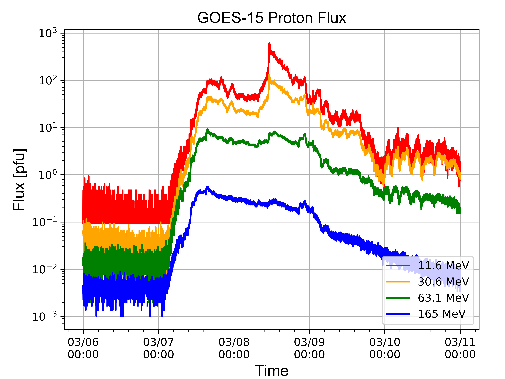

# Space Weather Projects

# Tasks
- [x] Proton Flux

- [x] Neutron Monitor

- [x] Type III Radio Bursts

- [ ] Fix issues with matplotlib DateFormatter "year out of range"

- [ ] Collect GOES-15 Xray data

- [ ] Collect WIND/ACE Solar Wind data

- [ ] Integrate all data into subplots


# Running Scripts

### Neutron Monitor ([nm_script](https://github.com/byamashiro/Research_Projects/blob/master/pandas_test_nm.py))
In [1]: **run pandas_test_nm.py**  
Enter start date (yyyymmdd): 20120304  
Enter a end date (yyyymmdd): 20120318  
Enter a start hour or "full": full  
How many stations to parse: 2  
You are parsing 2 station(s)  
Enter station names: INVK  
Enter station names: OULU  
Parsing the ['INVK', 'OULU'] stations  


### GOES-15 Proton Flux ([prot_script](https://github.com/byamashiro/Research_Projects/blob/master/pandas_test_proton.py))
In [2]: **run pandas_test_proton.py**  
Enter a start date (yyyymmdd): 20120305  
Enter a end date (yyyymmdd): 20120309  





### WIND Type III Radio Burst ([radio_script](https://github.com/byamashiro/Research_Projects/blob/master/pandas_test_radio.py))
In [3]: **run pandas_test_radio.py**  
Enter a start date (yyyymmdd): 20120307  
Enter a end date (yyyymmdd): 20120307  
Enter a start hour or "full": 00  
Enter a end hour: 03  
Parsing Type III Data: [20120307 00:00:00 -- 20120307 03:00:00]  
Elapsed Time: 16.3 seconds  


###### Sample displayed data of pandas data:

### Sample Type III Radio Burst Data
```
                             12            16        20        24        28  \
12_16                                                                         
2012-03-01 00:00:30  01-03-2012  00:00:30.000  1.182980  1.179540  1.176100   
2012-03-01 00:01:30  01-03-2012  00:01:30.000  1.281410  1.202890  1.124380   
2012-03-01 00:02:30  01-03-2012  00:02:30.000  1.021370  1.043250  1.065120   
2012-03-01 00:03:30  01-03-2012  00:03:30.000  1.107890  1.114680  1.121480 
...
```
### Neutron Monitor Data
```
                        OULU     INVK
datetime                             
2012-03-06 00:00:00  106.625  190.810
2012-03-06 00:05:00  105.342  189.426
2012-03-06 00:10:00  106.199  188.382
2012-03-06 00:15:00  105.591  191.880
2012-03-06 00:20:00  104.626  191.370
...
```

### Proton Flux Data
```
      P3W_QUAL_FLAG  P3W_UNCOR_CR  P3W_UNCOR_FLUX  P4W_QUAL_FLAG  \
0               NaN           NaN             NaN            NaN   
1               0.0      0.030488        0.093809            0.0   
2               NaN           NaN             NaN            NaN   
3               0.0      0.030488        0.093809            0.0   

...
```


Data Set | Normalized (Y/N) | Bad Data Specifiers
------------ | ------------- | -------------
Proton Flux | N | -99999.0, 0.0
Xray Flux | N | -99999.0, 0.0
Neutron Monitor Rate | N | n/a 
Radio Burst | N | n/a 


# Data
The data consists of mainly flux data from instruments on the ground, Earth orbit, and at the L1 Lagrange point. The data includes a sample from (2012 March), not normalized, and complete in intervals of about 30 seconds to a minute. Data values that were not accepted are denoted at extreme negative values around -9999. The specifics of each data set is commented in each header.

### Data Caveats
Corrupted data is labeled as -99999.0, and 0.0 flux is most probable to be corrupted as well. Corrupted data is changed using the pandas replace function to np.nan.

GOES-13 Proton Flux

GOES-15 Xray Flux

ACE Magnetic Field Components

ACE Solar Wind Parameters

OULU Neutron Monitor Data
