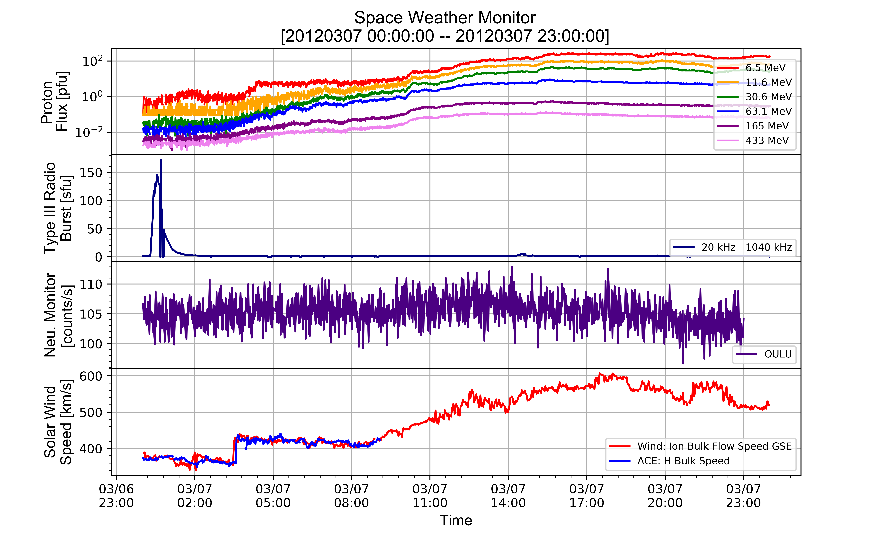

# Space Weather Projects

**Table of Contents**

- [Current Tasks](#current-tasks)
- [Current Errors and Pressing Tasks](#current-errors-and-pressing-tasks)
- [Required Python Modules](#required-python-modules)
- [Running Scripts](#running-scripts)
    - [OMNI Space Weather (omni_script_v2)](#omni-space-weather-omni_script_v2)
    - [Remastered WIND Type III Radio Burst (radio_script_v2)](#remastered-wind-type-iii-radio-burst-radio_script_v2)
    - [Neutron Monitor (nm_script)](#neutron-monitor-nm_script)
    - [Remastered GOES-15 Proton Flux (prot_script_v2)](#remastered-goes-15-proton-flux-prot_script_v2)
    - [Solar Wind Speed (swind_script)](#solar-wind-speed-swind_script)
    - [Legacy OMNI Space Weather (1995-2009) (legacy_omni_script_v1)](#legacy-omni-space-weather-1995-2009-legacy_omni_script_v1)
- [Deprecated Scripts](#deprecated-scripts)
- [Data](#data)
  - [Data Caveats](#data-caveats)
  - [Data Originals](#data-originals)
  - [Sample Data](#sample-data)
- [Completed Tasks](#completed-tasks)
- [Resolved Errors](#resolved-errors)


# Current Tasks

- [ ] Collect WIND/ACE Solar Wind data
    - [x] Bulk speed (7/12/2017)
    - [ ] Temperature
    - [ ] Magnetic field components/absolute value

- [ ] Add GOES-13 xray flux
    - [ ] Add markers and tags to certain xray flux magnitudes


- [ ] Push headers to data without forcing pandas names with files that have different header line numbers
    - [ ] regex? solution to accept only header and data rows
    - [ ] python solution to differentiate between header and data rows, and commented information


- [ ] Change 'for' loops into list comprehension

- [ ] Integrate SOHO data
    - [ ] SOHO proton flux bins
    - [ ] Proton flux bin detectors

- [ ] Dst and Kp data
    - [ ] Kp data in boxes form
    - [ ] AE index interchangeable with Dst index
    - [ ] Gather datasets and plot individually
    - [ ] Plot both datasets on one axis canvas


# Current Tasks and Errors

### Download SOHO proton flux data and plot
1) SOHO data title format is not uniform (i.e erne-yyyy.mm.dd-yyyy.mm.dd-{non-uniform-number}.tgz)
2) SOHO data is in .tgz format, with the tar files including 20+ data files in them. Only files of HED#.SL2 are of use.
- Current options
  - **wget**: Download .tgz file, extract only HED*.SL2 and push data into memory, delete local files, plot (downloading to local)
  - **urllib, tarfile**: Read .tgz into memory, extract only HED*.SL2 and push data into memory, plot (time intensive, no backwards seeking)
3) Download only the HED without the wget function extracting the low energy files.

### Seeking backwards with tarfile
- The current method is inefficient as all the files in the tarfile must be first read into memory, then applying statements. The script currently is time intensive, possibly due to the tarfile existing online. A possibility for the time inflation could be that the script iterates through every element of the tarfile to load headers, then must repeat the process to press 'if' statements.
- Using an 'if' statement with the tarfile.open() command results in an error. This error seems to be caused because the 'if' statement reads through the entire tarfile with the cursor at the end. The action following the 'if' statement then tries to proceed, but since the cursor is at the end, the script fails when moving in the opposite direction. Potential solution is to find a .seek(0) function for the tarfile module.  
```StreamError: seeking backwards is not allowed```  

```python
with tarfile.open(fileobj=ftpstream, mode="r|gz") as tar:
    hed_soho = [
      tarinfo for tarinfo in tar.getmembers()
      if tarinfo.name.startswith('export.src/HED') # the error occurs at this point
  ]
  tar.extractall(members=hed_soho)
```

### Outliers and changes for Solar Wind script
- Values significantly over 1000 km/s and single points need to be removed from the dataset. Incorporate temperature and magnetic field components from both ACE and Wind. Aesthetic fixes to the current wget downloading scheme, and find a more efficient method of downloading variant versions of .cdf files. Look for different data sources for solar wind speed with a lower time interval. Deviations are not negligible between both ACE and Wind solar wind speed measurements, see the output [figure](Plots/solarwind_test.png).


### Outliers for Radio Burst script
- Values ~300 sfu that seem to be outliers. Values will be removed, but each spike includes more than 1 point, therefore a single max threshold will not suffice.


### NaN values for Neutron Monitor script for lack of data
- Some neutron monitors do not have data and will return NaN values. When the script runs and the NaN values are added, the title columns will be shifted since there is no data in those columns. Essentially, 3 labels will be made for 2 columns, and the headers might not match the correlated data.

# Required Python Modules
Module       | Submodule(s) | as | Uses
------------ | ------------- | ------------- | -------------
**pandas**       | -                | pd          | DataFrames, indexing, plotting, downloading http url data, csv_reader()
**numpy**        | -                | np          | NaN values
**spacepy**      | pycdf            | -           |  Reading Common Data Format
**urllib**       | error            | -           | For HTTPError recognition
**random**       | -                | -           | Randomizer for random colors
**matplotlib**   | .pyplot, .mdates | plt, mdates | Plotting, subplots, date formatting
**datetime**     | -                | -           | Datetime indexing, datetime strings, datetime conversion from strings
**sys**          | -                | -           | Exiting script
**wget**         | -                | -           | Downloading files online (.cdf, .csv, .ascii, .txt)
**os**           | -                | -           | Remove files through script


# Data Sources
## Currently Implemented
Data       | Instrument | Detector | Source | URL
------------ | ------------- | ------------- | -------------| -------------
**GOES Proton Flux**            | GOES-13,15        | EPEAD               | NOAA | https://satdat.ngdc.noaa.gov/sem/goes/data/new_full/
**Legacy GOES Proton Flux**     | GOES-08,10        | EPS                 | NOAA | https://satdat.ngdc.noaa.gov/sem/goes/data/new_avg/
**TypeIII Radio Burst**         | Wind              | RAD1 (20-1040 kHz)  | CDAW | https://cdaweb.gsfc.nasa.gov/pub/data/wind/waves/wav_h1/
**GOES Xray Flux**              | GOES-15           | XRS                 | NOAA | https://satdat.ngdc.noaa.gov/sem/goes/data/new_full/
**Neutron Monitor Counts**      | NM Stations       | IGY, NM64           | NMDB | http://www.nmdb.eu/nest/
**ACE Solar Wind Parameters**   | ACE               | SWEPAM              | CDAW | https://cdaweb.gsfc.nasa.gov/pub/data/ace/swepam/level_2_cdaweb/swe_h0/
**Wind Solar Wind Parameters**  | Wind              | SWE                 | CDAW | https://cdaweb.gsfc.nasa.gov/pub/data/wind/swe/swe_k0/


## Prospective Datasets
**Kp Index**     | Ground Based Magnetometers                | Planetary           | NOAA | ftp://ftp.swpc.noaa.gov/pub/indices/old_indices/
**Dst Index**          | Ground Based Magnetometers                | Kyoto           | WDC | http://wdc.kugi.kyoto-u.ac.jp/
**AE Index**         | -                | -           | - | -
**SOHO Proton Flux**           | SOHO                | ERNE           | SRL | https://srl.utu.fi/export/
****           | -                | -           | - | -
****           | -                | -           | - | -
****           | -                | -           | - | -


# Running Scripts

### OMNI Space Weather ([omni_script_v2](https://github.com/byamashiro/Research_Projects/blob/master/Scripts/pandas_test_omni.py))

In [433]: **run pandas_test_omni.py**  
\========================================  
\=               DATASETS               =  
\========================================  
1 - GOES-15 Proton Flux  
2 - Wind Type III Radio Bursts  
3 - Neutron Monitor Counts  
4 - ACE/Wind Solar Wind Speed  
\========================================  
Enter Dataset Option then "done" or "all": all  
Enter a start date (yyyymmdd): 20120307  
Enter a end date (yyyymmdd): 20120307  
Enter a start hour or "full": full  
  
\========================================  
\=         GOES-15 Proton Flux          =  
\========================================  
Energy Channels  
\--------------------  
1: 6.5 MeV  
2: 11.6 MeV  
3: 30.6 MeV  
4: 63.1 MeV  
5: 165 MeV  
6: 433 MeV  
Enter Energy Channel(s) or "full": full  
100% [............................................................................] 456806 / 456806  
\========================================  
\=      Wind Type III Radio Bursts      =  
\========================================  
100% [..........................................................................] 3555206 / 3555206  
Parsing Type III Data for 2012-03-07  
  
\========================================  
\=           Neutron Monitors           =  
\========================================  
How many stations to parse: 2  
You are parsing 2 station(s)  
Enter station names: OULU  
Enter station names: INVK  
Parsing the ['OULU', 'INVK'] stations  
  
\========================================  
\=      ACE/Wind Solar Wind Speed       =  
\========================================  
100% [............................................................................] 169472 / 169472  





### Remastered WIND Type III Radio Burst ([radio_script_v2](https://github.com/byamashiro/Research_Projects/blob/master/Scripts/radio_remastered.py))
#### Single Day
In [33]: **run radio_remastered.py**  
Enter start date (yyyymmdd): 20120307  
Enter a end date (yyyymmdd): 20120307  
Enter a start hour or "full": 00  
Enter a end hour: 04  
100% [..........................................................................] 3555206 / 3555206  
Parsing Type III Data for 2012-03-01  

Plotting Type III Data: [20120307 00:00:00 -- 20120307 04:00:00]  
Elapsed Time: 0.96 seconds  


#### Multiple Days
In [96]: **run radio_remastered.py**  
Enter start date (yyyymmdd): 20120301  
Enter a end date (yyyymmdd): 20120304  
Enter a start hour or "full": full  
100% [..........................................................................] 3555206 / 3555206  
Parsing Type III Data for 2012-03-01  
100% [..........................................................................] 3555206 / 3555206  
Parsing Type III Data for 2012-03-02  
100% [..........................................................................] 3555206 / 3555206  
Parsing Type III Data for 2012-03-03  
100% [..........................................................................] 3555206 / 3555206  
Parsing Type III Data for 2012-03-04  

Plotting Type III Data: [20120301 00:00:00 -- 20120304 23:00:00]  
Elapsed Time: 3.35 seconds  


### Neutron Monitor ([nm_script](https://github.com/byamashiro/Research_Projects/blob/master/Scripts/pandas_test_nm.py))
In [1]: **run pandas_test_nm.py**  
Enter start date (yyyymmdd): 20120304  
Enter a end date (yyyymmdd): 20120318  
Enter a start hour or "full": full  
How many stations to parse: 2  
You are parsing 2 station(s)  
Enter station names: INVK  
Enter station names: OULU  
Parsing the ['INVK', 'OULU'] stations  


### Remastered GOES-15 Proton Flux ([prot_script_v2](https://github.com/byamashiro/Research_Projects/blob/master/Scripts/pandas_test_proton.py))
In [115]: **run pandas_test_proton.py**  
Enter a start date (yyyymmdd): 20120306  
Enter a end date (yyyymmdd): 20120315  
Enter a start hour or "full": full  
Energy Channels  
\======================  
1: 6.5 MeV  
2: 11.6 MeV  
3: 30.6 MeV  
4: 63.1 MeV  
5: 165 MeV  
6: 433 MeV  
Enter Energy Channel(s) or "full": full  
100% [............................................................................] 456593 / 456593  
Plotting GOES-15W Proton Flux Data: [20120306 00:00:00 -- 20120315 23:00:00]  


### Solar Wind Speed ([swind_script](https://github.com/byamashiro/Research_Projects/blob/master/Scripts/pandas_test_swind.py))
In [25]: **run pandas_test_swind.py**  
Enter a start date (yyyymmdd): 20120306  
Enter a end date (yyyymmdd): 20120308  
Enter a start hour or "full": full  
100% [........................................................] 150195 / 150195  
VERSION ERROR: The version v00 for WIND data does not exist, attempting v01  
100% [........................................................] 150195 / 150195  
VERSION ERROR: The version v00 for WIND data does not exist, attempting v01  
100% [........................................................] 150195 / 150195  
VERSION ERROR: The version v00 for WIND data does not exist, attempting v01  
  
VERSION ERROR: The version v01 for WIND data does not exist, attempting v02  
100% [........................................................] 169472 / 169472  
Plotting Solar Wind Data: [20120306 00:00:00 -- 20120308 23:00:00]  


### Legacy OMNI Space Weather (1995-2009) ([legacy_omni_script_v1](https://github.com/byamashiro/Research_Projects/blob/master/Scripts/pandas_test_legacy.py))

In [583]: **run pandas_test_legacy.py**  
\========================================  
\=               DATASETS               =  
\========================================  
1 - GOES-8,10 Proton Flux (1995-Present)  
2 - Wind Type III Radio Bursts (1994-Present)  
3 - Neutron Monitor Counts  
4 - ACE/Wind Solar Wind Speed (1998-Present)/(1994-Present)  
5 - GOES-8,10 Xray Flux (1995-Present)  
\========================================  
Enter Dataset Option then "done" or "all": 1  
Enter Dataset Option then "done" or "all": 2  
Enter Dataset Option then "done" or "all": 4  
Enter Dataset Option then "done" or "all": 5  
Enter Dataset Option then "done" or "all": done  
Enter a start date (yyyymmdd): 20031028  
Enter a end date (yyyymmdd): 20031028  
Enter a start hour or "full": full  
\========================================  
\=           GOES Satellites            =  
\========================================  
1 - GOES-8 (1995 - 1998)  
2 - GOES-10 (1999 - 2009)  
3 - GOES-13 (2010 - Present) DO NOT USE!  
\========================================  
Enter GOES Satellite Option: 2  
  
\========================================  
\=  GOES-10 Time Averaged Proton Flux   =  
\========================================  
Energy Channels  
\--------------------  
1: 0.6 - 4.0 MeV  
2: 4.0 - 9.0 MeV  
3: 9.0 - 15.0 MeV  
4: 15.0 - 44.0 MeV  
5: 40.0 - 80.0 MeV  
6: 80.0 - 165.0 MeV  
7: 165.0 - 500.0 MeV  
Enter Energy Channel(s) or "full": full  
100% [..........................................................................] 5637540 / 5637540  
\========================================  
\=      Wind Type III Radio Bursts      =  
\========================================  
100% [..........................................................................] 3539967 / 3539967  
Parsing Type III Data for 2003-10-28  
  
\========================================  
\=      ACE/Wind Solar Wind Speed       =  
\========================================  
100% [............................................................................] 165376 / 165376  
\========================================  
\=   GOES-10 Time Averaged Xray Flux    =  
\========================================  
\========================================  
\=           GOES Satellites            =  
\========================================  
1 - GOES-8 (1995 - 1998)  
2 - GOES-10 (1999 - 2009)  
3 - GOES-13 (2010 - Present) DO NOT USE!  
\========================================  
Enter GOES Satellite Option: 2  
100% [..........................................................................] 2097840 / 2097840  


# Deprecated Scripts
Deprecated [scripts](https://github.com/byamashiro/Research_Projects/tree/master/Scripts/deprecated_scripts) are kept for reference. All scripts are working, but most do not incorporate online data fetching. The first [event script](https://github.com/byamashiro/Research_Projects/blob/master/Scripts/deprecated_scripts/deprecated_event.py) that used local files is included in the folder. The event script is highly inefficient as it reads data from year-long data files. This is not the desired method when pulling data from half a day, which in turn will read the entire year data. Old [bash scripts](https://github.com/byamashiro/Research_Projects/tree/master/Scripts/deprecated_scripts/bash_scripts) are also added to archive old/inefficient methods of collecting data and reducing.

### Old Scripts
Filename       | Type | Run Command | Functionality
------------ | ------------- | ------------- | -------------
 (getgoes.sh)[https://github.com/byamashiro/Research_Projects/blob/master/Scripts/deprecated_scripts/bash_scripts/getgoes.sh]  | bash                | ./get_goes.sh yyyymm yyyy mm  | Download datafile from GOES-13/15 (first EPEAD then HEPAD), make directory for intermediate files and final converted files, delete all header rows, collect only specified columns, delimit from ',' to ' ', move cleaned data to directory, delete intermediate files.
 -  | -                | -          | -
 -  | -            | -           |  -
 -  | -            | -           | -
 -  | -                | -           | -
 -  | - | - | -
 -  | -                | -           | -
 -  | -                | -           | - 
 -  | -                | -           | - 
 -  | -                | -           | - 
 

# Data
The data consists of mainly flux data from instruments on the ground, Earth orbit, and at the L1 Lagrange point. The data includes a sample from (2012 March), not normalized, and complete in intervals of about 30 seconds to a minute. Data values that were not accepted are denoted at extreme negative values around -9999. The specifics of each data set is commented in each header.

### Data Caveats
Corrupted data is labeled as -99999.0, and 0.0 flux is most probable to be corrupted as well. Corrupted data is changed using the pandas replace function to np.nan.

### Data Originals
GOES-13 Proton Flux  
GOES-15 Xray Flux  
ACE Magnetic Field Components  
ACE Solar Wind Parameters  
OULU Neutron Monitor Data  

### Sample Data

#### Sample Type III Radio Burst Data
```
                             12            16        20        24        28  \
12_16                                                                         
2012-03-01 00:00:30  01-03-2012  00:00:30.000  1.182980  1.179540  1.176100   
2012-03-01 00:01:30  01-03-2012  00:01:30.000  1.281410  1.202890  1.124380   
2012-03-01 00:02:30  01-03-2012  00:02:30.000  1.021370  1.043250  1.065120   
2012-03-01 00:03:30  01-03-2012  00:03:30.000  1.107890  1.114680  1.121480 
...
```
#### Neutron Monitor Data
```
                        OULU     INVK
datetime                             
2012-03-06 00:00:00  106.625  190.810
2012-03-06 00:05:00  105.342  189.426
2012-03-06 00:10:00  106.199  188.382
2012-03-06 00:15:00  105.591  191.880
2012-03-06 00:20:00  104.626  191.370
...
```

#### Proton Flux Data
```
      P3W_QUAL_FLAG  P3W_UNCOR_CR  P3W_UNCOR_FLUX  P4W_QUAL_FLAG  \
0               NaN           NaN             NaN            NaN   
1               0.0      0.030488        0.093809            0.0   
2               NaN           NaN             NaN            NaN   
3               0.0      0.030488        0.093809            0.0   

...
```


Data Set | Normalized (Y/N) | Bad Data Specifiers
------------ | ------------- | -------------
Proton Flux | N | -99999.0, 0.0
Xray Flux | N | -99999.0, 0.0
Neutron Monitor Rate | N | n/a 
Radio Burst | N | n/a
Solar Wind Speed | N | < 0.0


# Completed Tasks

- [x] Add feature to add a line for extrema (i.e max, min, etc.) (7/22/2017)


- [x] Switch all GOES proton flux from GOES-15 to GOES-13 (7/19/2017)


- [x] Collect GOES-15 Xray data (7/18/2017)
- [x] Incorporate online databases for radio and proton data (7/18/2017)

- [x] Remake GOES Proton Flux scripts (7/18/2017)
    - [x] Automate script to download File name: g15_epead_p27e_32s_20120307_20120307 from https://satdat.ngdc.noaa.gov/sem/goes/data/new_full/2012/03/goes15/csv/ (7/10/2017)
    - [x] Energy range flux selections (6 channels) (7/10/2017)
    - [x] Collect GOES data from legacy satellites if specific date is not found (7/18/2017)
        - [x] Integrate GOES 8-13 satellites for date ranges (7/18/2017)
        - [x] Collect "new_avg" data (7/18/2017)
          - [x] Collect the same "new_full" data in the modern proton event dates (7/18/2017)
        - [x] Specify energy range to be collected, must be over 100 MeV (7/18/2017)
        - [x] Script must be modified for changes in strings in the "new_avg" files (7/18/2017)
          - [x] Attempt to pull specific GOES model from file string (i.e g10, 10) (7/18/2017)


- [x] Integrate all data into subplots (7/15/2017)
    - [x] Incorporate all pandas data frames from other scripts into one script (7/13/2017)
    - [x] Dynamic subplots (7/15/2017)
    - [x] Fix all subplot axis labels and legends (7/15/2017)
    - [x] Set appropriate logscale (7/15/2017)

- [x] Remake Radio Burst script using CDF and online databases (7/8/2017)
    - [x] Use pycdf **(module: spacepy)** to read CDF data (7/6/2017)
    - [x] Push data into pandas dataframe (7/7/2017)
    - [x] Set up automated url inputs (7/8/2017)

- [x] Fix issues with matplotlib DateFormatter "year out of range" (7/5/2017)
  - [x] Added issue with null errors in data frames (7/5/2017)


- [x] Proton Flux (7/3/2017)
- [x] Neutron Monitor (7/3/2017)
- [x] Type III Radio Bursts (7/3/2017)


# Resolved Errors

### GOES legacy data (7/22/2017)
* **Resolution**: The GOES Proton script was broken up into two functioning scripts. Eventually the two scripts will be merged again, but since there is discrepancy between older GOES satellites, they were split. The older GOES satellites (8 and 10) do not have flux in specific energy bins, but rather energy ranges (i.e 80.0 - 165.0 MeV). This type of binning is discontinued in the GOES-13/15 satellites as each bin corresponds to one specific energy (i.e 165 MeV). Since the Wind satellite was functional in 1995 and beyond, the subplot functionality is kept with the Type III and solar wind data. Older neutron monitors were also online during the legacy period and older detectors can be selected.
- GOES proton flux data requires modifications to omni code. GOES-13 does not cover years in the early 2000's, therefore older GOES satellites must be used. Older satellites do not have full "new_data" as in the GOES-13 to GOES-15 models, therefore the time averaged data "new_avg" will be used, the specific energy range needs to be determined. Safeguards in the omni script to stop data collection from before 2011 must also be manipulated to allow for these dates. 


### Dynamic subplots and modifications to the Omni script (7/15/2017)
* **Resolution**: Set up a global variable to initialize a dynamic variable that would allow for slicing with a defined set. To make this work, the .axes slicing method was invoked, but required an overhaul on the plot function for each dataset (i.e. every plot function needed to be the same, with only the global index changing). Using the .axes slices allowed for subplots, but in turn, .plt functions did not edit all subplots. The .plt functions only edit the final added subplot, therefore changes must be added right after the plot function for each subplot using the .axes methods.

- Devise a way to plot selected datasets on subplots. The script runs with all data is loaded, but breaks with selections. Although the script is dynamic, there currently must be a static plot to host the first plot, and then subplots are appended to that "anchor" plot. Therefore, if the static anchor dataset is not chosen, the script cannot build on an empty canvas. The optimal solution seems to be unpacking different subplots (i.e. fig, (ax1, ax2, ...)). This solution requires that ax1, etc. must be literals and not strings, which removes options such as "for" loops with a list. An idea was to force a string to be a variable name, but this option should not be used if possible. A lambda function was also considered, but wildcard logic doesn't seem optimal for data frames while calling .index and columnized data.
- Minor tick gridlines for y-axis should be added with minorticks on. Add legends for each subplot and y-axis labels with units. but also reduce size of the legend and y-axis labels. Neutron monitor data seems to be cut off past the ~23 hour mark, include the rest of that data. Insert an "if" statement to deter plotting of neutron monitor data (long-term changes) and type III radio burst data (short-term changes) on the same canvas. 


### Set up online CDF reader through Python (7/8/2017)
* **Resolution**: Used wget instead of requests and urllib library. The .cdf is downloaded locally and removed after the data is inserted into a data variable.

- Add online functionality to ([radio_script_v2](https://github.com/byamashiro/Research_Projects/blob/master/Scripts/radio_remastered.py)). The script currently runs offline with local data files. Attempt was made using urllib and requests, but response is in binary/byte format and cannot be read with .json() methods. Possibly encode/decode into ascii format and run through CDF methods. **Note**: Each .cdf file might contain different versions (i.e _v02) for string recognition.
- The easier and less efficient option would be to download the data from each site and run the .cdf reader locally.


### Null values (resolved 7/5/2017)
* **Resolution**: There were three spaces in front of the null values, delimit whitespace to removed them. As a quick fix, 3 spaces were added to the 'na_values' argument, '   null', ``` na_values=['   null']```.  

- Some values are being registered as 'null'. Tried to add ``` na_values=['null']``` to the read_csv function, but the null is still being processed and results in a plotting error. To recreate error, run the 'pandas_test_nm.py' script for 20120307-20120309 (full) for stations (2) INVK and OULU.
- Resolution will probably consist of removing null values, list comprehension on all null values in pandas dataframe.  
```TypeError: Empty 'DataFrame': no numeric data to plot```

```python
                       OULU     INVK
datetime                            
2012-03-08 17:28:00  96.459  176.470
2012-03-08 17:29:00  98.389  173.920
2012-03-08 17:30:00  94.656     null
2012-03-08 17:31:00  92.282  172.800
2012-03-08 17:32:00  94.688  175.980
2012-03-08 17:33:00  97.718  175.790
2012-03-08 17:34:00  97.269  177.460
2012-03-08 17:35:00  98.304  176.330
```


### DateFormatter (resolved 7/5/2017)
* **Resolution**: Used the matplotlib plot function instead of the pandas plot function. The new function used was ``` plt.plot(nm_data.index, nm_data[f'{i}'], color=rand_color, label=f'{i}')``` instead of ``` nm_data[f'{i}'].loc[f'{event_obj_start_str_date}':f'{event_obj_end_str_date}'].plot(color=rand_color, label= f'{i}')```.

- Code breaks when trying to format the x-axis labels using the DateFormatter function from matplotlib in the script, 'pandas_test_nm.py'.
- Potentially the index are of a different definition, although each index shows the correct format 'yyyy-mm-dd hh:mm:ss' in the specified time interval between 20120307-20120309. Also test if delimiter could be changed to 'delim_whitespace=True' in read_csv function.  
```ValueError: year 60740 is out of range```

```python
import matplotlib.dates as mdates

myFmt = mdates.DateFormatter('%m/%d\n%H:%M')
ax.xaxis.set_major_formatter(myFmt) #this is line that breaks code (ValueError: year 60740 is out of range)
```

