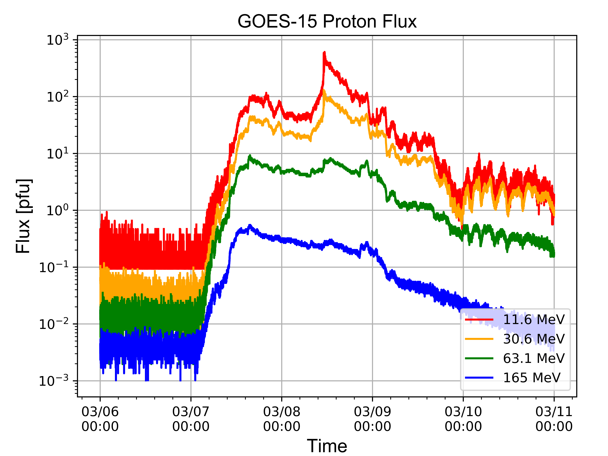
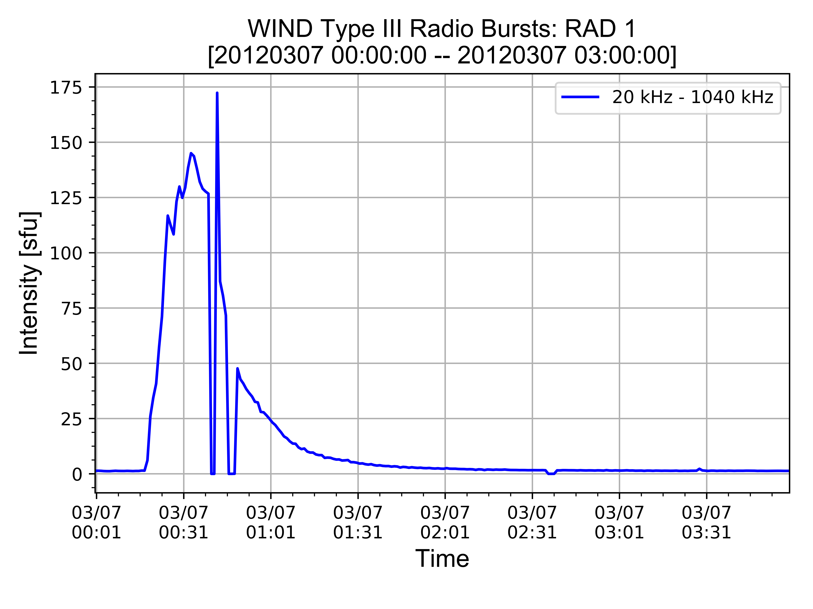

# Deprecated Scripts

### GOES-15 Proton Flux ([prot_script](https://github.com/byamashiro/Research_Projects/blob/master/Scripts/pandas_test_proton.py)) **[Deprecated]**
In [2]: **run pandas_test_proton.py**  
Enter a start date (yyyymmdd): 20120305  
Enter a end date (yyyymmdd): 20120309  

### WIND Type III Radio Burst ([radio_script_v1](https://github.com/byamashiro/Research_Projects/blob/master/Scripts/pandas_test_radio.py)) **[Deprecated]**
In [3]: **run pandas_test_radio.py**  
Enter a start date (yyyymmdd): 20120307  
Enter a end date (yyyymmdd): 20120307  
Enter a start hour or "full": 00  
Enter a end hour: 03  
Parsing Type III Data: [20120307 00:00:00 -- 20120307 03:00:00]  
Elapsed Time: 16.3 seconds  

### Remastered WIND Type III Radio Burst ([radio_script_v2](https://github.com/byamashiro/Research_Projects/blob/master/Scripts/radio_remastered.py)) **[Deprecated]**
#### Single Day
In [33]: **run radio_remastered.py**  
Enter start date (yyyymmdd): 20120307  
Enter a end date (yyyymmdd): 20120307  
Enter a start hour or "full": 00  
Enter a end hour: 04  
100% [..........................................................................] 3555206 / 3555206  
Parsing Type III Data for 2012-03-01  

Plotting Type III Data: [20120307 00:00:00 -- 20120307 04:00:00]  
Elapsed Time: 0.96 seconds  

#### Multiple Days
In [96]: **run radio_remastered.py**  
Enter start date (yyyymmdd): 20120301  
Enter a end date (yyyymmdd): 20120304  
Enter a start hour or "full": full  
100% [..........................................................................] 3555206 / 3555206  
Parsing Type III Data for 2012-03-01  
100% [..........................................................................] 3555206 / 3555206  
Parsing Type III Data for 2012-03-02  
100% [..........................................................................] 3555206 / 3555206  
Parsing Type III Data for 2012-03-03  
100% [..........................................................................] 3555206 / 3555206  
Parsing Type III Data for 2012-03-04  

Plotting Type III Data: [20120301 00:00:00 -- 20120304 23:00:00]  
Elapsed Time: 3.35 seconds  

### Neutron Monitor ([nm_script](https://github.com/byamashiro/Research_Projects/blob/master/Scripts/pandas_test_nm.py)) **[Deprecated]**
In [1]: **run pandas_test_nm.py**  
Enter start date (yyyymmdd): 20120304  
Enter a end date (yyyymmdd): 20120318  
Enter a start hour or "full": full  
How many stations to parse: 2  
You are parsing 2 station(s)  
Enter station names: INVK  
Enter station names: OULU  
Parsing the ['INVK', 'OULU'] stations  

### Remastered GOES-15 Proton Flux ([prot_script_v2](https://github.com/byamashiro/Research_Projects/blob/master/Scripts/pandas_test_proton.py)) **[Deprecated]**
In [115]: **run pandas_test_proton.py**  
Enter a start date (yyyymmdd): 20120306  
Enter a end date (yyyymmdd): 20120315  
Enter a start hour or "full": full  
Energy Channels  
\======================  
1: 6.5 MeV  
2: 11.6 MeV  
3: 30.6 MeV  
4: 63.1 MeV  
5: 165 MeV  
6: 433 MeV  
Enter Energy Channel(s) or "full": full  
100% [............................................................................] 456593 / 456593  
Plotting GOES-15W Proton Flux Data: [20120306 00:00:00 -- 20120315 23:00:00]  

### Solar Wind Speed ([swind_script](https://github.com/byamashiro/Research_Projects/blob/master/Scripts/pandas_test_swind.py)) **[Deprecated]**
In [25]: **run pandas_test_swind.py**  
Enter a start date (yyyymmdd): 20120306  
Enter a end date (yyyymmdd): 20120308  
Enter a start hour or "full": full  
100% [........................................................] 150195 / 150195  
VERSION ERROR: The version v00 for WIND data does not exist, attempting v01  
100% [........................................................] 150195 / 150195  
VERSION ERROR: The version v00 for WIND data does not exist, attempting v01  
100% [........................................................] 150195 / 150195  
VERSION ERROR: The version v00 for WIND data does not exist, attempting v01  

VERSION ERROR: The version v01 for WIND data does not exist, attempting v02  
100% [........................................................] 169472 / 169472  
Plotting Solar Wind Data: [20120306 00:00:00 -- 20120308 23:00:00]  

